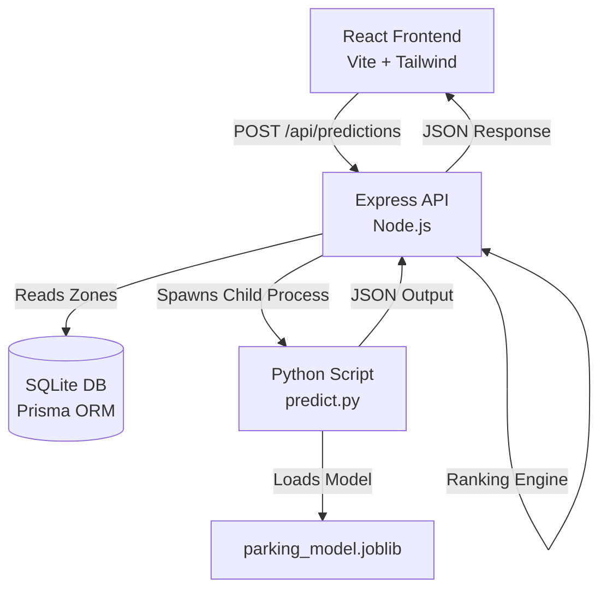

# System Architecture

ParkWise is designed as a three-tier architecture: a React frontend, a Node/Express orchestration layer, and a Python Machine Learning engine.

## High-Level Architecture

## Core Components

### 1. Frontend (React + Vite)
- **State Management**: Uses native React state (`useState`) scoped primarily in `App.tsx` for simplicity.
- **Styling**: Tailwind CSS for utility-first styling.
- **Mapping**: `react-leaflet` connected to OpenStreetMap tiles.
- **Proxy**: Vite proxies `/api/*` to the Express server to bypass CORS during development.

### 2. Backend (Express + Prisma)
- **Orchestration**: Express acts as the glue. It handles HTTP validation, queries the SQLite database for parking zone metadata, and delegates the heavy ML lifting to Python.
- **Ranking Engine**: The `recommendation.ts` service implements the business logic. It takes raw predictions from Python and applies a composite scoring algorithm to rank zones based on Availability, Distance, and Price.

### 3. Machine Learning (Python + Scikit-Learn)
- **Model**: A Random Forest Regressor trained on 84 days of simulated hourly data.
- **Integration**: Rather than running a separate Python HTTP server (like FastAPI), Node uses `child_process.spawn` to invoke `predict.py` via standard I/O. This "bridge" pattern dramatically simplifies deployment and local setup by keeping everything behind a single Node server port.
- **Features**: Day of week, hour, weather, event presence, and historical averages.

### 4. Database (SQLite)
- Chosen specifically for demoability and ease of setup. Requires no external database hosting or Docker containers.
- Prisma provides a strongly-typed TypeScript client for seamless interaction.

## Data Flow: Prediction Request

1. **User Input**: User selects a date, time, weather, and event status on the frontend.
2. **API Call**: Frontend sends a JSON payload to `POST /api/predictions`.
3. **Database Fetch**: Express queries SQLite for all Koramangala parking zones.
4. **Python Bridge**: Express spawns `python ml/predict.py`, piping the request and zone data via `stdin`.
5. **Inference**: Python loads the pre-trained `joblib` model, structures the feature dataframe, predicts occupancy for each zone, and prints JSON to `stdout`.
6. **Ranking**: Express parses the Python output, combines it with pricing and distance metrics, and calculates the `recommendationScore`.
7. **Response**: The fully enriched and ranked array of zones is sent back to the frontend.
